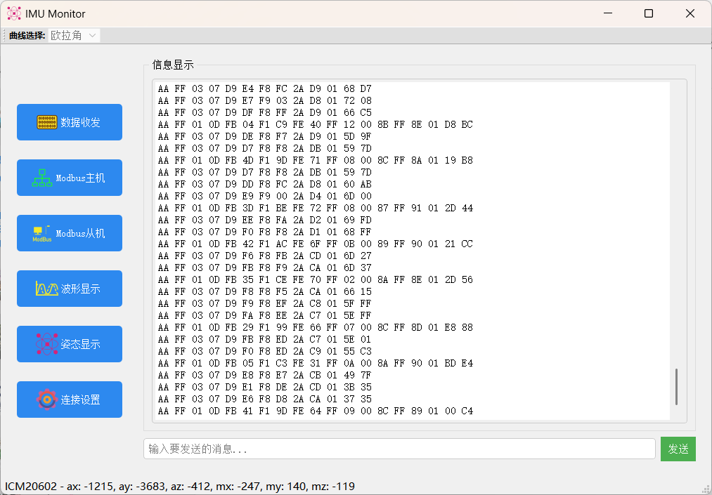
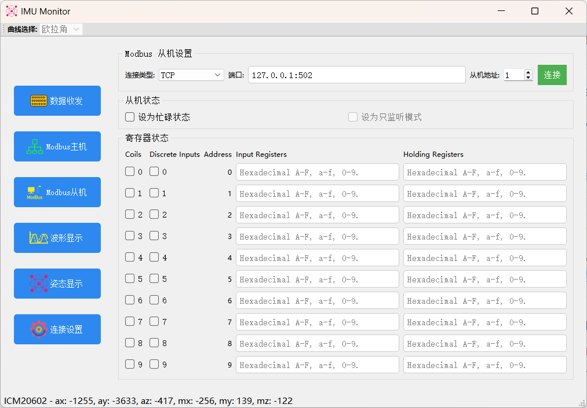
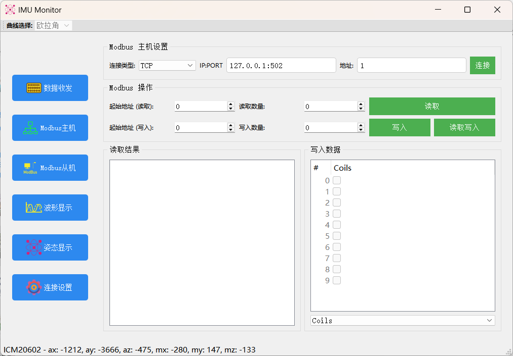
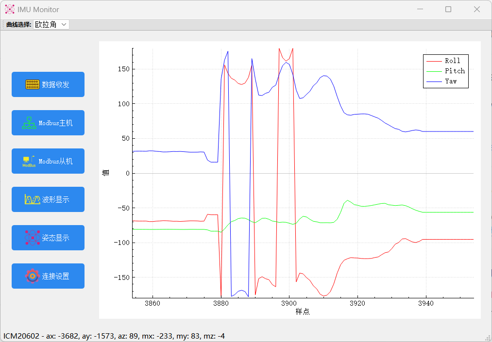
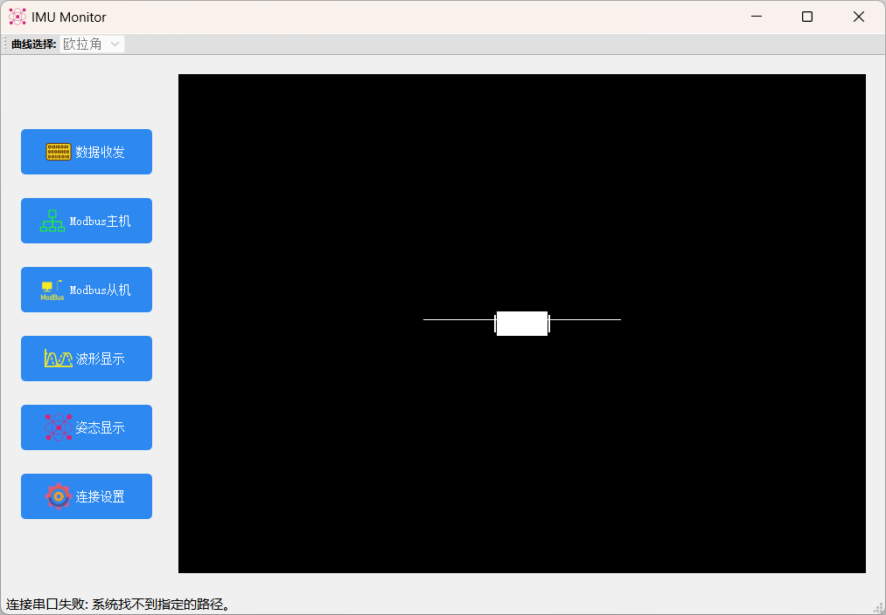

QT5项目

1。协议
ID：0x03：飞控姿态：欧拉角格式
帧头HEAD 目标地址D_ADDR 功能码ID 数据长度LEN 数据内容DATA 和校验SC 附加校验AC
0xAA    0xFF            0x03    7           格式如下    程序计算 程序计算
DATA 区域内容：
数据类型 int16 int16 int16 uint8
数据内容 ROL*100 PIT*100 YAW*100 FUSION_STA
ROL、PIT、YAW：姿态角，依次为横滚、俯仰、航向，精确到 0.01。
FUSION _STA：融合状态。

2.功能

（1）基本数据收发

（2）ModBus主、从机

（3）波形显示

（4）IMU姿态三维展示。

